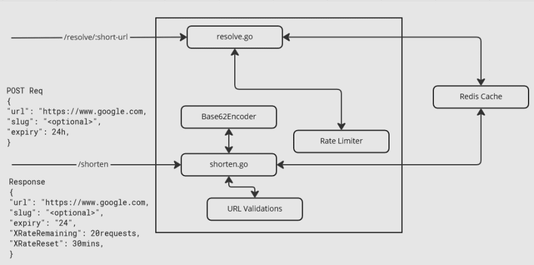

# URL Shortener using Redis and Go

A simple URL shortener service implemented using Go programming language and Redis as the backend data store. This project aims to provide a minimalistic and efficient solution for shortening long URLs and redirecting users to the original URLs.

## Features

- Shorten long URLs to a compact format.
- Redirect users from the short URL to the original URL.
- Utilizes Redis for fast and reliable data storage.
- Have RateLimiting which means that you cannot hit the endpoint after some ITERATION (API_QUOTA)

## System Design 




## Getting Started

These instructions will help you set up the project and get it running on your local machine for development and testing purposes.

### Prerequisites

To run this project, you need to have the following tools installed on your system:

- Go (at least Go 1.11)
- Redis

### Installation

1. Clone the repository

   ```bash
   git clone https://github.com/jiteshchawla1511/url-shortener.git
   ```
2. Navigate to the project directory:
   ```bash
   cd url-shortner
   ```
3. Install the project dependencies
   ```bash
   go mod download
   ```

### Running the Application 

1. Start the Redis Server 
   ```bash
   redis-server
   ```
2. Run the main file
   ``` bash
   go run main.go
   ```
3. Now send/POST the JSON OBJECT TO URL http://localhost:3000/api/v1
   ``` JSON OBJECT
   {
      "url" : "{url Link}"
   }
   Example 
   {
      "url" : "https://www.youtube.com/watch?v=dQw4w9WgXcQ"
   }
   ```

### Structure of ENV FILE 

- DB_ADDR="localhost:6379"

- DB_PASS=""

- APP_PORT=":3000"

- DOMAIN="localhost:3000"

- API_QUOTA=10
